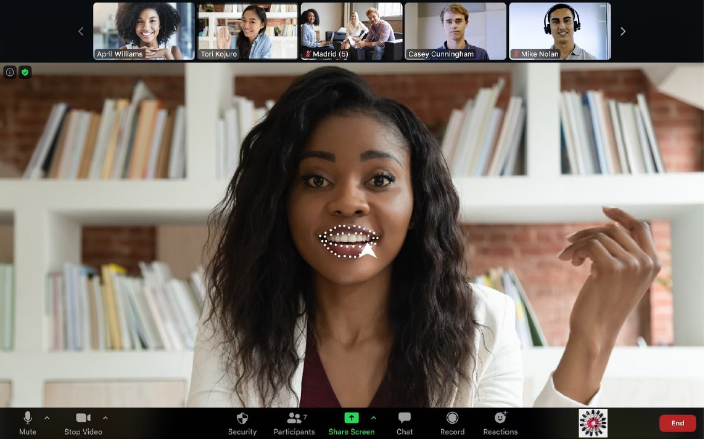
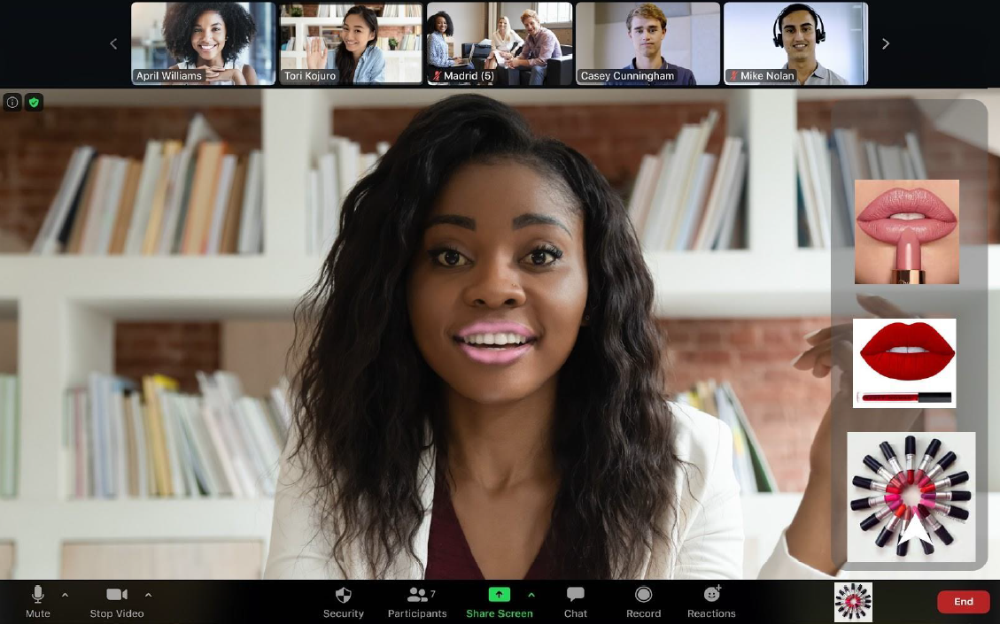

# Trinity’s Mirror

## Summary

The Project Trinity’s Mirror is aimed at creating a digital face & makeup filter for professional video conferences.

## Background

In a business context, very often a professional look is required, for example a shaved face, makeup, a tie. Also, often people use a distinctive appearance for the definition of their image and self. In the world pre-Corona, this required (sometimes extensive) bathroom preparation with application of makeup etc. to create the wished-for appearance for business meetings.
 
  But with the COVID crisis, many companies have agreed with their employees to adapt a model of remote working or home office. Video and Telephone conferences have skyrocketed last year, Zoom reached 300 million peak daily meeting participants. This created the opportunity, that to have a professional appearance, it is no longer necessary to change the actual physical appearance.
  
  Being in home office, you no longer need to apply makeup in order to “look made up”. Trinity’s Mirror will create a customized mask that can be used in video conferences to create a look of the applied makeup of choice.
  
  While this service is primarily based on a female user group, a further development could be to extend the service to creating filters for (un)shaved skin, hair styles, dresses etc.
  
  The U.S. makeup industry alone has an estimated revenue of approx. 50 billion US dollars in 2020. In the last years, the cosmetic industry struggled with image problems, as production, in majority of cases, is harmful to the environment (microlastics, etc.) or involves animal testing. Additionally, many branded cosmetics may be very expensive. A fully digital product would allow to create the desired look without the above mentioned downturns. And it would increase the customer happiness by reducing the morning bath routine in the home office.
  
  The digital makeup filter would not completely replace physical cosmetic applications, but could be a cost-efficient, animal testing free and environmentally friendly alternative to existing products. Hereby, it rather will not conquer shares of existing products, but would create a new industry. Gaining 10% of the cosmetic industry market, which would be 5 billion USD in the US, is an eligible target, when accounting for that digital filters could be used by 150 million zoom users (estimating 50% of the 300 million users are female) daily.

## How is it used?

The application will display an icon at the bottom of the video conferencing tool that includes the filter masks. The minimum MVP will be an application for Zoom and will focus only on the lips.
  
  The user would click on the icon and a banner will be displayed, showing a color palette and products of the partners.

  
  The user can then choose which filter to apply by clicking on the product or color palette, and the lips will be colored (I apologize for my painting skills).

  
  Trinity’s Mirror is clearly designed for a female user, who is looking for to create a professional appearance during a video call without needing to apply makeup physically (due to time constraints, expensive makeup, allergies and other).
  
  The business case includes the free installation of the app and free use of a handful of predefined filters as an application add-on for zoom.
  
  A partnership with cosmetic companies will enable to create more filters for makeup and to use these for the advertisement of their products. The team of Trinity’s Mirror will develop and design digital products based on actual products of the cosmetic companies they want to push.
  
  Additionally, users will be enabled to create custom filters. In order to create a custom filter, a paid premium version has to be used, which will generate recurring revenue. Additionally, custom filters could be sold on a marketplace to motivate users to create better and more real-life filters, and by this enabling an income generation from the app for users and influencers.

## Data sources and AI methods

Trinity’s Mirror will create a mask for video conferencing that could be applied before the start of or during a video conference.
  
 Similar technologies are applied by Snapchat. It uses combination of Histogram of Oriented Gradients (HOG for short) and Support Vector Machine (SVM) to detect and apply keypoints to certain regions in the face and alter the face using the Active Shape Model. Using these techniques, Trinity’s Mirror could replicate the technology to create filter masks and develop an application for conferencing technologies (Zoom, Google Meet, Microsoft Teams etc.) but with a focus on business appearance.

  
  An additional way could be to use a [Mask R-CNN]( https://engineering.matterport.com/splash-of-color-instance-segmentation-with-mask-r-cnn-and-tensorflow-7c761e238b46) model to separate special regions from the face that could be altered to display makeup (for more info see here, Instance Segmentation) or use a GAN to create makeup filters from images (for more info, see here [PSGAN]( https://github.com/wtjiang98/PSGAN) makeup filter research).
Trinity’s Mirror Project will develop and test all three possibilities, choosing the best alternative with regard to authenticity of the makeup filter, performance in video streams, flexibility of the model to changes for application (for creating custom filters).
  
  A sound amount of datasets for face detection purposes can be find open source in the internet:

|Name of dataset|Link|
|---|---|
|Celeba|http://mmlab.ie.cuhk.edu.hk/projects/CelebA.html |
|or same but on Kaggle|https://www.kaggle.com/jessicali9530/celeba-dataset |
|Top 15 Free Image Datasets for Facial Recognition (Kaggle)|https://www.kaggle.com/c/deepfake-detection-challenge/discussion/121594 |
|10 Face Datasets To Start Facial Recognition Projects (Good)|https://analyticsindiamag.com/10-face-datasets-to-start-facial-recognition-projects/ |
|MAAD-Face: A Massively Annotated Attribute Dataset for Face Images (Good, +code)|https://github.com/pterhoer/MAAD-Face |
|Labeled Faces in the Wild|http://vis-www.cs.umass.edu/lfw/ |
|Celeb_a (from tensorflow website)|https://www.tensorflow.org/datasets/catalog/celeb_a |
|Ibug 300-W|https://ibug.doc.ic.ac.uk/resources/300-W/ |
|Helen dataset|http://www.ifp.illinois.edu/~vuongle2/helen/ |

The main model will be trained on these free datasets by using transfer learning technique and applying the training to a model pre-trained on ImageNet (like VGG). The later application will also use transfer learning to fetch the trained main model and to use a handful of video sequences from a call to create custom weights for the applicator’s face. 

  
  For the creation of the model the Helen dataset and the ibug 300-W dataset are at the moment the most important ones, as they are already annotated with keypoints. They are all opensource and have a good and diverse base of faces. 
  
  The Helen and the ibug 300-W dataset are annotated with keypoints as below:

  
  For the Instant segmentation (Mask R-CNN) an additional annotation of face regions (e.g. lips) has to be made on a dataset of faces, which will be done by the VIA VGG annotator.
For the PSGAN model, the dataset also needs to be annotated in order to classify images with makeup styles and images without makeup.

## Challenges

Of course, video data from business meetings is very private and sensitive. If possible, federated learning will be applied to leverage privacy for the users. 
  
  Additionally, it must be ensured that the dataset is diverse enough to cover for bias. The datasets used to generate additional features will be checked for bias before training. The faces in the dataset will be checked to represent diversity in age, gender, skin color, hair color, face expressions, face positions etc. It should also include some emotional expressions, like anger, joy, sadness etc. for the model to be able to detect the specific details in different stages of a conversation.
  
  There are three key metrics that are relevant for performance:
The accuracy metric will reflect the ability of the model to correctly detect a specific detail in a users face and being able to track it during movements.
  
  Authenticity is absolutely necessary to create a good user experience. For example, the color must not look artificial, cover the whole region, change according to light etc. The feedback from users will be an essential metric to decide when a filter is sufficiently realistic.
Additionally, the model should not slow down the video conferencing, so the performance speed of the applied mask will be also an evaluation metric.
  
  Upfront, it is not possible to say which combination of the metrics above will be sufficient for a good performance. This will be tested and improved during the pilot phase of the project.

## What next?

The first step will be to create the free application version with a number of predefined filters and integrate it into the environment of video conferencing applications (Zoom, later Google Meet etc.).
  
  Additionally, cosmetic companies will be approached in order to get agreements for the creation of product filters that can be used for advertisement.
Advertisement on social media will generate attention to create a first user base.
* Number of custom filters
* Average prices and number of sold custom filters

Trinity’s Mirror will require skills to build and train the model, the federated learning technology, the application deployment to video conferencing tools and the user interface. Using AutoML only is not sufficient for this task.
  
  These technologies, esp. increasing the performance of the model and the user experience require an ongoing development beyond the launch. That is why an in-house team is preferred for this project.
  
  To improve the product, the following actions could be made:

* Add more video conferencing technologies in which the product can be applied (Google Meet, Microsoft Teams, Jitsi etc.)
* Add more features for makeup, like eyes, eyebrows, foundation…
* Address male userbase with features like beards, shaving, etc.
* Add additional features like dresses, backgrounds, hair stylings, product placement in the background (and by this add partnerships beyond the makeup industry)
* Finally, explore AR applications in which this product could be integrated

For adding additional features, specific datasets must be created and annotated (e.g. beards). The AI will learn based on increasing number of conversations to detect and locate the attributes of the face more much more accurate. The filters will become more realistic.
A/B testing could be applied to explore which products or product colors to introduce. Also it could be used to test the authenticity of the applied filters.
For example, the lipstick color could be changed slightly to reflect light and shades, and the new color would be made accessible to a testing group.

## Acknowledgments

Many thanks to Ana Vekilova, Siyan Feyisetan and Wissem Marzouki, who worked with me on this project during our scholarship for AI product manager. 
  
Other sources:
 
[Snapchat’s Filters: How the Application Recognizes a Human Face by Elsa Stringer]( https://demotix.com/snapchat-filters/)
 
[Mask R-CNN by Waleed Abdulla]( https://engineering.matterport.com/splash-of-color-instance-segmentation-with-mask-r-cnn-and-tensorflow-7c761e238b46)
 
[PSGAN by Wentao Jiang, Si Liu, Chen Gao, Jie Cao, Ran He, Jiashi Feng, Shuicheng Yan, Zhaoyi Wan](https://github.com/wtjiang98/PSGAN)

